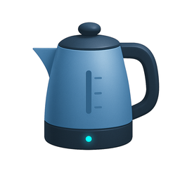

# Kettle

<div align="center">
  
  <h3>A Modern Homebrew GUI Manager for macOS</h3>
  <p>
    <a href="https://github.com/eskiyin/Kettle/releases/latest">
      
    </a>
    <a href="https://github.com/eskiyin/Kettle/blob/main/LICENSE">
      
    </a>
    <a href="https://github.com/eskiyin/Kettle/stargazers">
      
    </a>
  </p>
</div>

## Features

🚀 **Modern Interface**
- Native macOS app built with SwiftUI
- Clean and intuitive user interface
- Dark mode support

🎯 **Core Functionality**
- Manage Homebrew packages, casks, and taps
- Start/stop services
- View detailed package information
- Easy installation and removal
- Real-time status monitoring

⚡️ **Performance**
- Fast and responsive
- Efficient caching system
- Minimal resource usage

🔒 **Security**
- No analytics or tracking
- Open source and transparent
- Secure credential handling

## Screenshots

[Screenshots will be added here]

## Installation

### Requirements
- macOS 12.0 or later
- Homebrew installed on your system

### Download
1. Download the latest version from the [Releases](https://github.com/eskiyin/Kettle/releases) page
2. Open the DMG file
3. Drag Kettle to your Applications folder

### Build from Source
```bash
# Clone the repository
git clone https://github.com/eskiyin/Kettle.git

# Navigate to the project directory
cd Kettle

# Open in Xcode
open Kettle.xcodeproj

# Build and run the project
```

## Usage

### First Launch
1. Launch Kettle from your Applications folder
2. If Homebrew is not installed, Kettle will offer to install it for you
3. Grant necessary permissions when prompted

### Basic Operations
- **Packages**: View, install, update, and remove Homebrew packages
- **Services**: Manage Homebrew services (start, stop, restart)
- **Taps**: Add or remove Homebrew taps
- **Casks**: Manage macOS applications installed via Homebrew

## Contributing

We welcome contributions! Here's how you can help:

1. Fork the repository
2. Create your feature branch (`git checkout -b feature/AmazingFeature`)
3. Commit your changes (`git commit -m 'Add some AmazingFeature'`)
4. Push to the branch (`git push origin feature/AmazingFeature`)
5. Open a Pull Request

Please read our [Contributing Guidelines](CONTRIBUTING.md) for details.

## Development

### Prerequisites
- Xcode 14.0 or later
- macOS 12.0 or later
- Homebrew

### Project Structure
```
Kettle/
├── Services/         # Core services and managers
├── Models/          # Data models
├── Views/           # SwiftUI views
├── Extensions/      # Swift extensions
└── Resources/       # Assets and resources
```

## License

This project is licensed under the MIT License - see the [LICENSE](LICENSE) file for details.

## Acknowledgments

- [Homebrew](https://brew.sh/) - The missing package manager for macOS
- The SwiftUI community for inspiration and support
- All our contributors and users

## Support

If you encounter any issues or have questions:
- Open an [issue](https://github.com/eskiyin/Kettle/issues)
- Check our [Discussions](https://github.com/eskiyin/Kettle/discussions) page
- Read the [Wiki](https://github.com/eskiyin/Kettle/wiki)

---

<div align="center">
  Made with ❤️ by <a href="https://github.com/eskiyin">eskiyin</a>
</div>